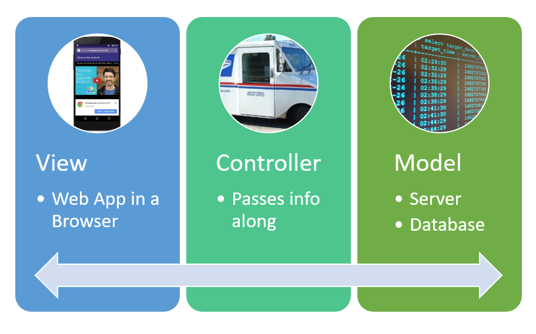

# Class 02 Readings (Sept. 4th)

## Clean Code

### 1. Craftsmanship

- knowledge and work. You must gain
  the knowledge of principles, patterns, practices, and heuristics that a craftsman knows, and
  you must also grind that knowledge into your fingers, eyes, and gut by working hard and
  practicing.

### 2. Learning to Write Code

- Learning to write clean code is hard work. It requires more than just the knowledge of
  principles and patterns. You must sweat over it. You must practice it yourself, and watch
  yourself fail. You must watch others practice it and fail. You must see them stumble and
  retrace their steps. You must see them agonize over decisions and see the price they pay for
  making those decisions the wrong way

### 3. Learning to write clean code

- Writing clean code requires the disciplined use of a myriad little techniques applied
  through a painstakingly acquired sense of “cleanliness.” This “code-sense” is the key.
  Some of us are born with it. Some of us have to fight to acquire it. Not only does it let us
  see whether code is good or bad, but it also shows us the strategy for applying our discipline to transform bad code into clean code

## Array Methods

1. forEach() - this method can help you to loop over array's items

```javascript
const arr = [1, 2, 3, 4, 5, 6];

arr.forEach((item) => {
  console.log(item); // output: 1 2 3 4 5 6
});
```

2. includes() - this method checks if an array includes the item passed in the method.

```javascript
const arr = [1, 2, 3, 4, 5, 6];

arr.includes(2); // output: true
arr.includes(7); // output: false
```

3. filter() - this method create new array with only elements passed condition inside the provided function.

```javascript
const arr = [1, 2, 3, 4, 5, 6];

// item(s) greater than 3
const filtered = arr.filter((num) => num > 3);
console.log(filtered); // output: [4, 5, 6]

console.log(arr); // output: [1, 2, 3, 4, 5, 6]
```

4. map() - this method create new array by calling the provided function in every element.

```javascript
const arr = [1, 2, 3, 4, 5, 6];

// add one to every element
const oneAdded = arr.map((num) => num + 1);
console.log(oneAdded); // output [2, 3, 4, 5, 6,  7]

console.log(arr); // output: [1, 2, 3, 4, 5, 6]
```

5. reduce() - The reduce() method applies a function against an accumulator and each element in the array (from left to right) to reduce it to a single value

```javascript
const arr = [1, 2, 3, 4, 5, 6];

const sum = arr.reduce((total, value) => total + value, 0);
console.log(sum); // 21
```

6. some() - This method check if at least one of array's item passed the condition. If passed, it return 'true' otherwise 'false'.

```javascript
const arr = [1, 2, 3, 4, 5, 6];

// at least one element is greater than 4?
const largeNum = arr.some((num) => num > 4);
console.log(largeNum); // output: true

// at least one element is less than or equal to 0?
const smallNum = arr.some((num) => num <= 0);
console.log(smallNum); // output: false
```

7. every() - This method checks to see if all array's item passed the condition. If passed, it returns 'true' otherwise 'false'.

```javascript
const arr = [1, 2, 3, 4, 5, 6];

// all elements are greater than 4
const greaterFour = arr.every((num) => num > 4);
console.log(greaterFour); // output: false

// all elements are less than 10
const lessTen = arr.every((num) => num < 10);
console.log(lessTen); // output: true
```

8. sort() - This method used to arrange/sort array's item either ascending or descending order.

```javascript
const arr = [1, 2, 3, 4, 5, 6];
const alpha = ["e", "a", "c", "u", "y"];

// sort in descending order
descOrder = arr.sort((a, b) => (a > b ? -1 : 1));
console.log(descOrder); // output: [6, 5, 4, 3, 2, 1]

// sort in ascending order
ascOrder = alpha.sort((a, b) => (a > b ? 1 : -1));
console.log(ascOrder); // output: ['a', 'c', 'e', 'u', 'y']
```

9. Array.from() - This change all thing that are array-like or iterable into true array especially when working with DOM, so that you can use other array methods like reduce, map, filter and so on.

```javascript
const name = "frugence";
const nameArray = Array.from(name);

console.log(name); // output: frugence
console.log(nameArray); // output: ['f', 'r', 'u', 'g', 'e', 'n', 'c', 'e']
```

10. Array.of() - This create array from every arguments passed into it.

```javascript
const nums = Array.of(1, 2, 3, 4, 5, 6);
console.log(nums); // output: [1, 2, 3, 4, 5, 6]
```

---

## Class Syntax

- basic syntax is:

```javascript
class MyClass {
  // class methods
  constructor() { ... }
  method1() { ... }
  method2() { ... }
  method3() { ... }
  ...
}
```

Then use new MyClass() to create a new object with all the listed methods. The constructor() method is called automatically by new, so we can initialize the object there.

Example:

```javascript
class User {
  constructor(name) {
    this.name = name;
  }

  sayHi() {
    alert(this.name);
  }
}

// Usage:
let user = new User("John");
user.sayHi();
```

### What is a class?

Example:

```javascript
class User {
  constructor(name) {
    this.name = name;
  }
  sayHi() {
    alert(this.name);
  }
}

// proof: User is a function
alert(typeof User); // function
```

What class User {...} construct really does is:

1. Creates a function named User, that becomes the result of the class declaration. The function code is taken from the constructor method (assumed empty if we don’t write such method).
1. Stores class methods, such as sayHi, in User.prototype.

## Getters/Setters

- Like object literals, classes may include getters/setters, computed properties etc.

## Classes (MDN)

- Classes are in fact "special functions", and just as you can define function expressions and function declarations, the class syntax has two components: class expressions and class declarations.

- Declare a class by using the 'class' keyword with the name of the class like so:

```javascript
class Rectangle {
  constructor(height, width) {
    this.height = height;
    this.width = width;
  }
}
```

### Hoisting

- An important difference between function declarations and class declarations is that function declarations are hoisted and class declarations are not. You first need to declare your class and then access it, otherwise code like the following will throw a ReferenceError:

```javascript
const p = new Rectangle(); // ReferenceError

class Rectangle {}
```

### Class Expression

- A class expression is another way to define a class. Class expressions can be named or unnamed. The name given to a named class expression is local to the class's body.

### Class body and method definitions

- The body of a class is the part that is in curly brackets {}. This is where you define class members, such as methods or constructor.

1. Strict mode

- The body of a class is executed in strict mode, i.e., code written here is subject to stricter syntax for increased performance, some otherwise silent errors will be thrown, and certain keywords are reserved for future versions of ECMAScript.

1. Constructor

- The constructor method is a special method for creating and initializing an object created with a class. There can only be one special method with the name "constructor" in a class. A SyntaxError will be thrown if the class contains more than one occurrence of a constructor method.

## Sub classing with extends

- The extends keyword is used in class declarations or class expressions to create a class as a child of another class.

```javascript
class Animal { 
  constructor(name) {
    this.name = name;
  }
  
  speak() {
    console.log(`${this.name} makes a noise.`);
  }
}

class Dog extends Animal {
  constructor(name) {
    super(name); // call the super class constructor and pass in the name parameter
  }

  speak() {
    console.log(`${this.name} barks.`);
  }
}

let d = new Dog('Mitzie');
d.speak(); // Mitzie barks.
```
---
## MVC Framework

- MVC (model view controller) is an architectural pattern that separates an application into three main logical components: the model, the view, and the controller. Each of these components are built to handle specific development aspects of an application.

### MVC Components

1. Model - The Model component corresponds to all the data-related logic that the user works with. This can represent either the data that is being transferred between the View and Controller components or any other business logic-related data.

1. View - The View component is used for all the UI logic of the application.

1. Controller - Controllers act as an interface between Model and View components to process all the business logic and incoming requests, manipulate data using the Model component and interact with the Views to render the final output. 


---

Model View Controller is a predictable software design pattern that can be used across many frameworks with many programming languages, commonly Python, Ruby, PHP, JavaScript, and more. It is popularly used to design web applications and mobile apps.

### A couple of benefits of MVC
- Traditionally used for Graphical user interfaces (GUIs)
- Popular in web applications
- MVC responsibilities are divided between the client & server, compatible with web application architecture
- MVC is helpful design pattern when planning development

### Web App as a MVC


---