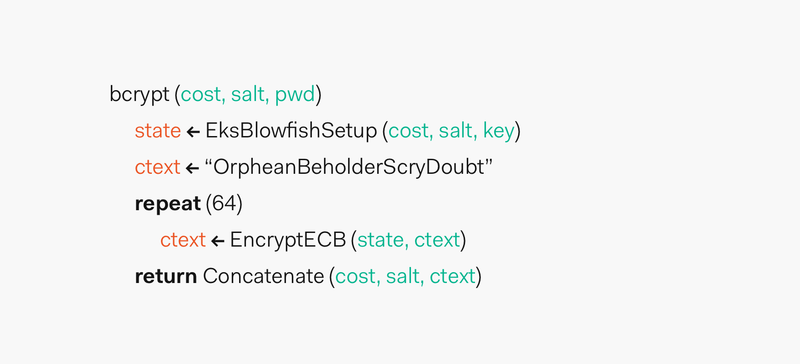

# Class 12 Readings (Sept. 28th)

## Why you should use bcrypt

- Hashed passwords are not good enough and put your info at risk

- BCrypt soulution - Using a Key Factor, BCrypt is able to adjust the cost of hashing. With Key Factor changes, the hash output can be influenced. In this way, BCrypt remains extremely resistant to hacks, especially a type of password cracking called rainbow table.

## Understanding bcrypt

- The bcrypt hashing function allows us to build a password security platform that scales with computation power and always hashes every password with a salt.

### What is bcrypt?

- bcrypt was designed by Niels Provos and David Mazières based on the Blowfish cipher: b for Blowfish and crypt for the name of the hashing function used by the UNIX password system.

### How does bcrypt work?

- Phase 1:

A function called EksBlowfishSetup is setup using the desired cost, the salt, and the password to initialize the state of eksblowfish. Then, bcrypt spends a lot of time running an expensive key schedule which consists of performing a key derivation where we derive a set of subkeys from a primary key. Here, the password is used as the primary key. In case that the user selected a bad or short password, we stretch that password/key into a longer password/key. The aforementioned practice is also known as key stretching.

What we are going through this first phase is to promote key strengthening to slow down calculations which in turn also slow down attackers.

Phase 2:

The magic value is the 192-bit value OrpheanBeholderScryDoubt. This value is encrypted 64 times using eksblowfish in ECB mode with the state from the previous phase. The output of this phase is the cost and the 128-bit salt value concatenated with the result of the encryption loop.

Algorithm that shows the two phases that make up the bcrypt implementation

The resulting hash is prefixed with $2a$, $2y$, or $2b$. The prefixes are added to indicate usage of bcrypt and its version.

---

## Where to store JWT

- When you're building a Next.js application, authentication might be needed in the following cases:

1. When accessing a page

1. When accessing an API route

1. When your application calls an API hosted outside of your Next.js application on behalf of the user

- Where a server is available, your app can handle the interaction with Auth0 and create a session, but in this model, we don't have a backend. All of the work happens on the frontend:

1. The user is redirected to Auth0.

1. When the user is successfully signed in, they will be redirected back to the application.

1. The client-side will complete the code exchange with Auth0 and retrieve the user's id_token and access_token which will be stored in memory.

