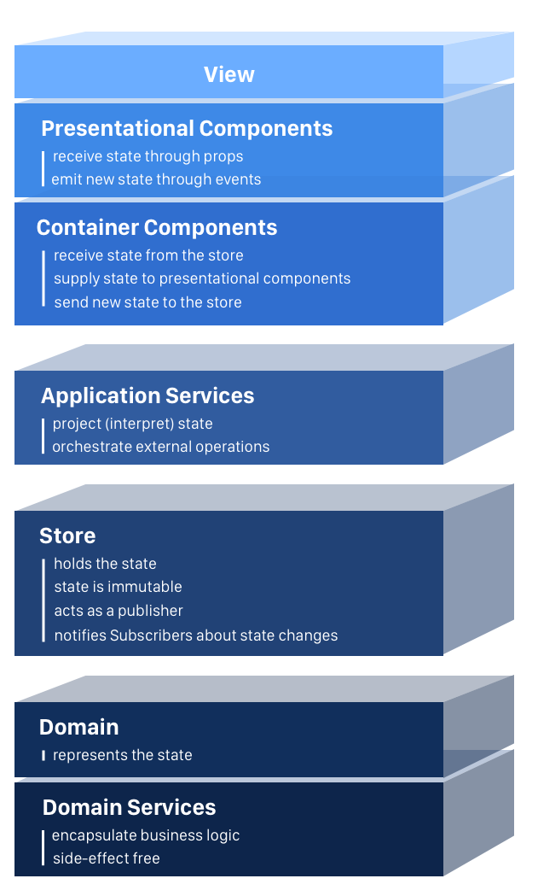

# MVC

- Model-View-Controller (Used for developing UI that cuts the related program logic into 3 interconnected elements.

1. Model: Central component of the patter. App's dynamic data structure, independent of the UI.
1. View: Any representation of information such as a chart, diagram or table. Multiple views of the same information are possible, such as a bar chart for management and a tabular view for accountants.
1. Controller: Accepts input and converts it to commands for the model or view.

---

# Single Page Application

- "Every successful project needs a clear architecture, which is understood by all team members."



---

# React MVC

1. Controller Components: A “controller component” knows a lot about the rest of the world. It knows how to access and update “domain data” (application state) and how to choose and execute “domain logic”. For instance, a controller component may know how to query and mutate data via a RESTful API or read/update objects stored in React Context. Generally, controllers are aware of context, side effects, and domains (application state and behavior).

1. View Components: A view component shouldn’t know anything about application state (reading or writing), network protocols, or non-UI providers farther up the chain. Views shouldn’t know what protocol you use to speak to a backend or the format that data takes. Views shouldn’t know about your custom state contexts and providers for sharing domain data (application state).  

    - a view should not call hooks useEffect() and useContext() except for UI-specific cases like the following:

```
Accessing context for UI-specific data and behavior: e.g. theming and routing
Syncing prop changes with local state with useEffect()
```

# Reconciliation

- React implements a heuristic O(n) algorithm based on two assumptions:

```
1. Two elements of different types will produce different trees.
2. The developer can hint at which child elements may be stable across different renders with a key prop.
```

### Diffing Algorithm

- When diffing two trees, React first compares the two root elements. The behaviour is different depending on the types of the root elements.

- When tearing down a tree, old DOM nodes are destroyed. Component instances receive componentWillUnmount(). When building up a new tree, new DOM nodes are inserted into the DOM. Component instances receive componentWillMount() and then componentDidMount(). Any state associated with the old tree is lost.

### Keys

- In order to solve this issue, React supports a key attribute. When children have keys, React uses the key to match children in the original tree with children in the subsequent tree. For example, adding a key to our inefficient example above can make the tree conversion efficient:

```JS
<ul>
  <li key="2015">Duke</li>
  <li key="2016">Villanova</li>
</ul>

<ul>
  <li key="2014">Connecticut</li>
  <li key="2015">Duke</li>
  <li key="2016">Villanova</li>
</ul>
```

- Now React knows that the element with key '2014' is the new one, and the elements with the keys '2015' and '2016' have just moved.